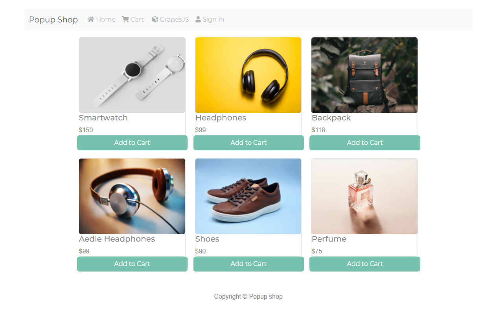
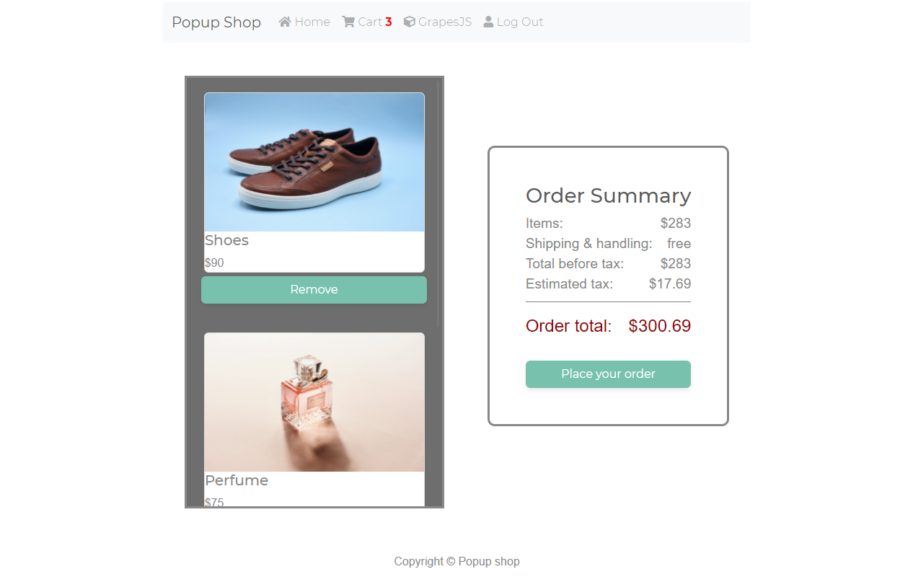
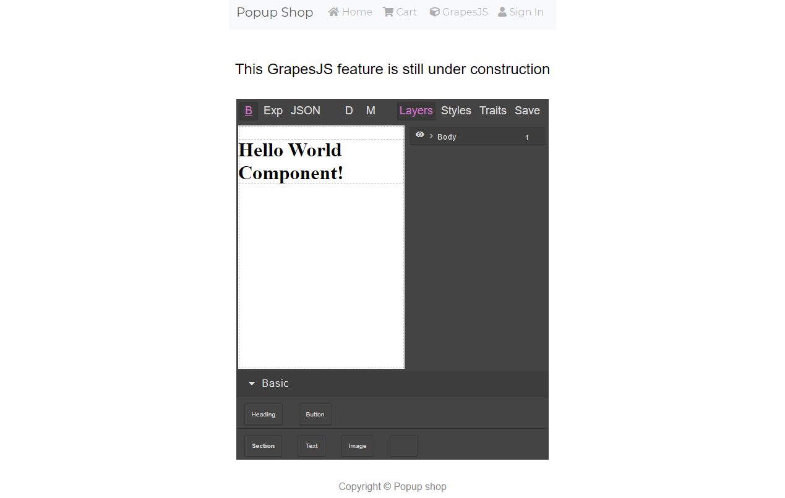

ShopApp lets you set up an online shop in minutes with an easy drag and drop builder. Or choose a premade template, add your images, description and price. 

Then set up your payment processing, with Stripe integration, and now your shop is ready for customers! 

Customers can browse through and select products to add to their cart. To access the cart feature, customers must create an account first. Their credentials are encrypted and JSON Web Tokens (JWTs) are used to grant authorization.

Here's a link to the live app: https://popupshop.vercel.app/

You can access the repo to the fullstack app here: https://github.com/chingu-voyages/v32-bears-team-07

Landing page:

Customer's cart:

GrapesJS builder:

Tech used includes React, Node, Express, MongoDB Atlas, GrapesJS, Stripe integration, Heroku, Vercel, and JWTs for authorization
